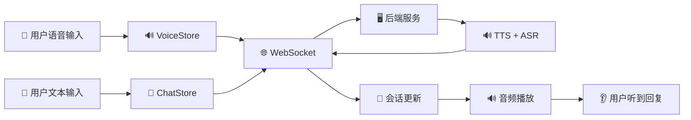

# 🎭 AI角色对话系统

> ✨ 让对话更自然，让交流更智能 - 基于 WebSocket 的实时语音交互引擎

[](https://vuejs.org/)
[](https://www.typescriptlang.org/)
[](https://developer.mozilla.org/zh-CN/docs/Web/API/WebSocket)
[](LICENSE)

## 📖 项目简介

AI角色对话系统是一个功能丰富的智能语音交互平台，支持多角色、多场景的实时语音对话体验。系统集成了先进的语音识别、语音合成技术，为用户提供沉浸式的角色扮演对话体验。

### 🎯 核心特性

| 功能模块 | 特性描述 | 技术亮点 |
|---------|---------|---------|
| 🎙️ **实时语音交互** | 支持浏览器原生录音，实时语音对话 | Web Audio API + WebSocket |
| 💬 **多模态对话** | 文本/语音双模式输入输出 | 智能消息路由 + 状态管理 |
| 🎭 **角色管理系统** | 预设角色库 + 自定义角色创建 | 角色收藏 + 个性化配置 |
| 🏞️ **沉浸式场景** | 多场景切换 + 背景氛围定制 | 动态场景加载 + 视觉优化 |
| 🔊 **多音色支持** | 动态切换语音合成音色 | 七牛云TTS集成 |
| 💾 **智能会话管理** | 多轮对话上下文维护 | 精准记忆 + 历史记录 |
| 📱 **响应式设计** | 完美适配桌面与移动端 | 自适应布局 + 触摸优化 |

## 🚀 快速开始

### 📋 环境要求

- **Node.js**: 16.0+ 
- **包管理器**: npm 或 yarn
- **浏览器**: Chrome 90+ / Firefox 88+ / Safari 14+
- **硬件**: 麦克风设备（语音输入）

### 🛠️ 安装与运行

#### 前端服务部署

```bash
# 1. 克隆项目
git clone git@github.com:programeGreenhand/AI-role-paly-frontend.git

# 2. 进入项目目录
cd AI-role-paly-frontend

# 3. 安装依赖
npm install

# 4. 启动开发服务器
npm run dev
```

#### 后端服务部署

后端项目地址：[roleEnd](https://github.com/programeGreenhand/roleEnd)

```bash
# 1. 克隆后端项目
git clone https://github.com/programeGreenhand/roleEnd.git

# 2. 进入项目目录
cd roleEnd

# 3. 安装依赖
npm install

# 4. 配置环境变量
cp .env.example .env
# 编辑 .env 文件，配置数据库和API密钥

# 5. 启动服务
npm start
```

## 🏗️ 系统架构

### 📦 核心模块设计

#### 1. WebSocket 通信层
**核心职责**: 管理实时双向通信

- 📡 **连接管理**: 自动重连机制 + 心跳检测
- 📨 **消息路由**: 音频/文本消息智能分发
- 🔄 **状态同步**: 连接状态 + 会话状态管理
- 🛡️ **错误处理**: 网络异常恢复 + 数据校验

#### 2. 语音处理层
**核心职责**: 语音输入输出全流程处理

- ⏺️ **录音控制**: 开始/停止/暂停状态管理
- 🔊 **音频处理**: 格式转换 + 数据编码优化
- 🎚️ **音色配置**: 动态切换 + 参数管理
- 📊 **状态指示**: 可视化录音/播放状态

#### 3. 会话管理层
**核心职责**: 对话上下文智能维护

- 🆔 **会话标识**: 唯一会话ID生成机制
- 📝 **消息历史**: 对话记录持久化存储
- 🔄 **上下文维护**: 多轮对话记忆管理

#### 4. 角色管理层
**核心职责**: 角色系统完整生命周期管理

- 🟡 **角色收藏**: 用户偏好角色管理
- 🩹 **角色自定义**: 个性化角色创建与配置
- 🎨 **角色展示**: 角色信息可视化呈现

### 🔗 数据流架构



## 🎥 演示视频

### 📹 功能演示

[](https://www.bilibili.com/video/BV1XYnozUE7C/?spm_id_from=333.1387.homepage.video_card.click&vd_source=0d3465ca3e8304b42e54780a38cc2a75)

[](https://www.bilibili.com/video/BV1zknZzaEKn/?spm_id_from=333.1387.homepage.video_card.click&vd_source=0d3465ca3e8304b42e54780a38cc2a75)

### 🎬 演示亮点

- 🎙️ **实时语音对话**: 按住说话，松开发送的流畅体验
- 🎵 **动态音色切换**: 支持多种音色实时切换
- 🥳 **多模态输入**: 文字/语音双模式自由选择
- 🔗 **智能重连机制**: 网络中断自动恢复
- 📱 **多端适配**: 桌面端与移动端完美体验
- 📕 **上下文记忆**: 智能记忆对话历史
- 🦸‍♀️ **角色管理**: 完整的角色创建与收藏系统
- 🎨 **美工设计**: 精美的界面与交互设计

## 🔧 技术栈

### 前端技术栈

| 技术领域 | 技术选型 | 版本 |
|---------|---------|------|
| **前端框架** | Vue 3 + TypeScript | 3.3.x |
| **状态管理** | Pinia | 2.1.x |
| **UI组件库** | Element Plus | 2.3.x |
| **路由管理** | Vue Router | 4.2.x |
| **实时通信** | WebSocket (原生) | - |
| **构建工具** | Vite | 4.4.x |
| **语音处理** | Web Audio API | - |

### 后端技术栈

- **核心框架**: Node.js + Express.js
- **数据库**: MySQL 8.0+
- **实时通信**: WebSocket
- **语音服务**: 七牛云语音合成
- **AI引擎**: DeepSeek API
- **文件存储**: 阿里云OSS

## 📊 性能指标

| 指标类型 | 性能表现 | 优化措施 |
|---------|---------|---------|
| 🚀 **连接建立** | < 200ms | WebSocket优化连接 |
| 🎙️ **语音延迟** | < 1.5s | 音频流式传输 |
| 🔄 **端到端响应** | < 2s | 全链路优化 |
| 📊 **并发支持** | 1000+ 连接 | 连接池管理 |

## 👥 团队分工

| 模块 | 负责人 | 主要职责 |
|------|--------|---------|
| **语音处理** | 余加福 | 录音控制、音频编解码、音色管理 |
| **网络通信** | 余加福 | WebSocket连接、消息协议、错误处理 |
| **会话管理** | 余加福 | 会话维护、上下文管理、状态同步 |
| **角色管理** | 余加福 | 角色系统设计、场景背景设计 |
| **前端集成** | 余加福 | Vue组件、用户交互、响应式设计 |
| **登录注册** | 余加福 | 认证系统、状态管理 |

## 🎯 使用场景

### 🏢 企业应用
- **智能客服**: 企业级语音客服系统
- **培训模拟**: 员工培训对话模拟
- **会议助手**: 智能会议记录与总结

### 🎓 教育领域
- **语言学习**: 外语口语练习平台
- **教学辅助**: 智能教学对话助手
- **在线辅导**: 个性化学习辅导

### 🎮 娱乐应用
- **角色扮演**: 沉浸式角色对话体验
- **语音社交**: 语音互动社交平台
- **游戏辅助**: 游戏内智能对话系统

## 🤝 贡献指南

我们欢迎所有形式的贡献！请阅读以下指南开始参与：

### 🐛 报告问题
如果您发现任何bug或有问题，请通过 [Issues](https://github.com/programeGreenhand/AI-role-paly-frontend/issues) 页面报告。

### 💡 功能建议
有新的功能想法？欢迎在 [Discussions](https://github.com/programeGreenhand/AI-role-paly-frontend/discussions) 中分享。

### 🔧 代码贡献
1. Fork 本项目
2. 创建特性分支 (`git checkout -b feature/AmazingFeature`)
3. 提交更改 (`git commit -m 'Add some AmazingFeature'`)
4. 推送到分支 (`git push origin feature/AmazingFeature`)
5. 开启 Pull Request

## 🆘 技术支持

### 📧 联系邮箱
- **项目问题**: yujiafushinc@163.com

### 📚 相关文档
- [后端项目文档](https://github.com/programeGreenhand/roleEnd)
- [API接口文档](./docs/api.md)
- [部署指南](./docs/deployment.md)

## 📄 许可证

本项目采用 MIT 许可证 - 查看 [LICENSE](LICENSE) 文件了解详情。

---

<div align="center">

## ⭐ 如果这个项目对你有帮助，请给我们一个 star！

**让智能语音对话触手可及** 🎤✨

[](https://star-history.com/#programeGreenhand/AI-role-paly-frontend&Date)

</div>
